# 🔍 Real-Time Fleet Telemetry Pipeline

> **SOC Level 1 Portfolio Project** — Anomaly detection on live streaming transit data using Microsoft Fabric, KQL, and Data Activator.


---

## 📋 Project Summary

The CEO of Digibus — a public transit authority — reported that several bus lines had vanished from their routes, stranding passengers across the city. Traditional monitoring had failed.

**Mission:** Build a real-time anomaly detection pipeline from scratch using Microsoft Fabric to identify the no-show buses.

This mirrors a real SOC scenario — an alert has fired, traditional tools missed it, and an analyst must build a detection rule from raw telemetry data.

| Detail | Value |
|--------|-------|
| **Platform** | Microsoft Fabric (60-day trial tenant) |
| **Database** | Eventhouse — DetectiveAgency |
| **Table** | BusTelemetry (live Eventstream) |
| **Query Language** | Kusto Query Language (KQL) |
| **Alerting** | Data Activator → Microsoft Teams |
| **Result** | Bus Lines 74 & 11 identified ✅ |

---

## 🗂️ Screenshot Evidence

### 01 — Project Requirement Brief
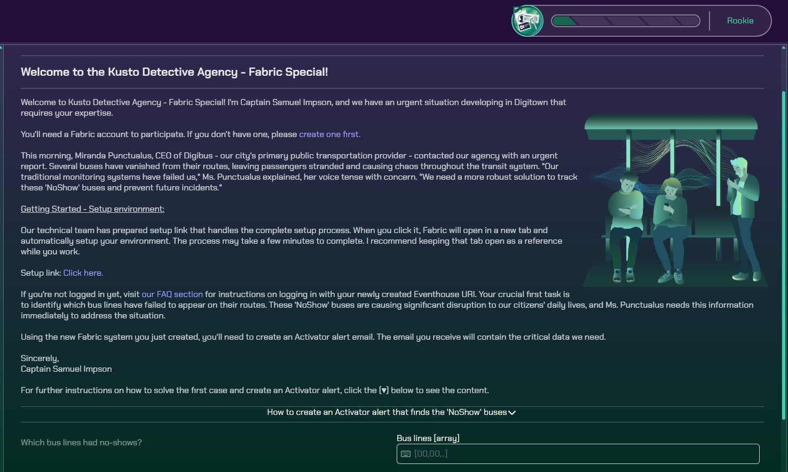
> Case briefing received from simulated transit authority. Objective: identify no-show bus lines causing service disruption. This mirrors a real SOC intake — translating a business problem into a technical investigation.

---

### 02 — Microsoft Fabric Environment Setup
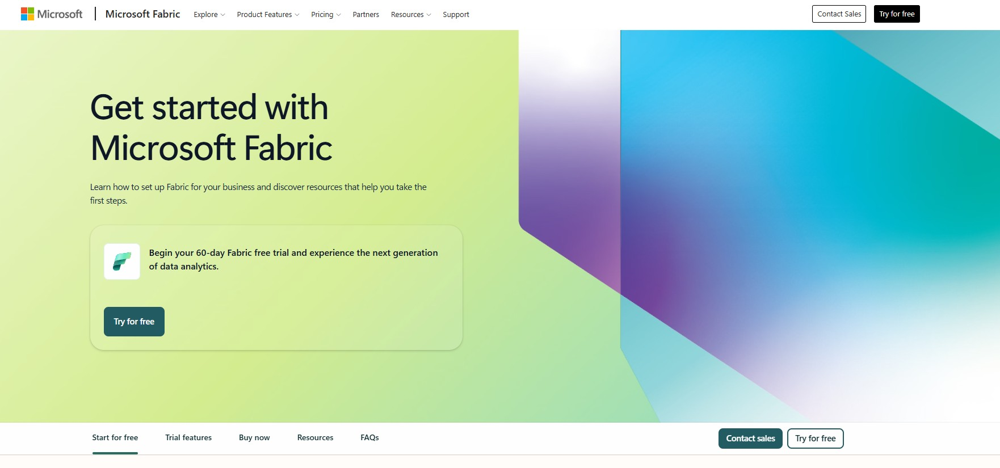
> Provisioned a Microsoft Fabric 60-day trial tenant. Familiarity with Microsoft cloud onboarding is directly applicable to enterprise SOC environments running Microsoft Sentinel and Defender.

---

### 03 — Fabric Workspace Dashboard
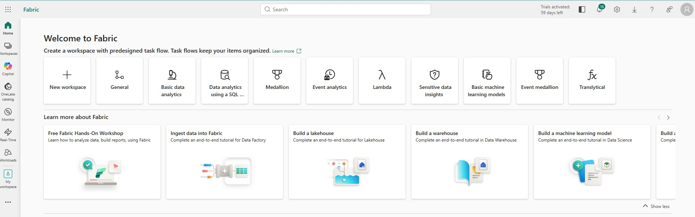
> Successfully activated Microsoft Fabric tenant with a provisioned workspace. Note the "59 days left" badge — confirming this is a live active environment, not a recycled screenshot.

---

### 04 — Eventhouse Provisioning In Progress
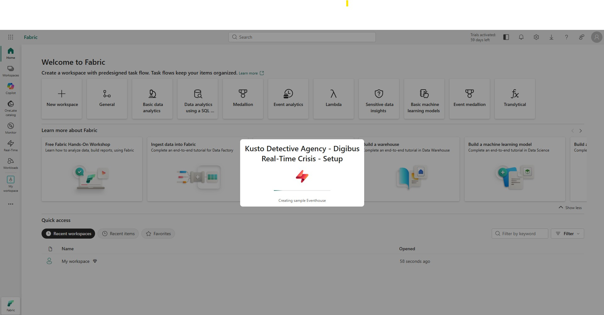
> Automated setup script created a live Eventhouse — Fabric's real-time database engine — to ingest streaming bus telemetry. This mirrors how enterprise SOC teams deploy log ingestion pipelines in Microsoft Sentinel.

---

### 05 — KQL Queryset Creation with Live BusTelemetry
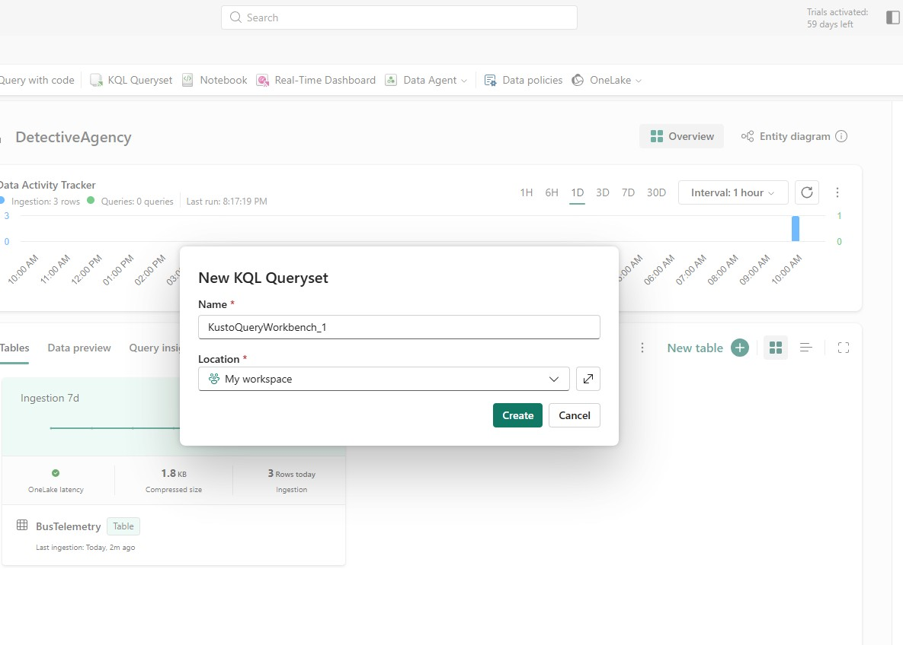
> KQL Queryset connected to the live DetectiveAgency Eventhouse. Data Activity Tracker confirms active ingestion — real-time streaming confirmed.

---

### 06 — KQL Workbench Connected
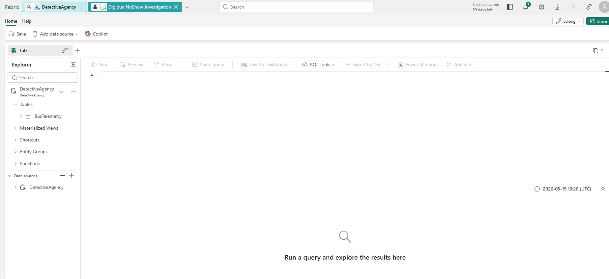
> Queryset named **Digibus_NoShow_Investigation** connected to BusTelemetry table. The "Add alert" button in the toolbar is the entry point to Data Activator.

---

### 07 — Data Activator Alert Setup
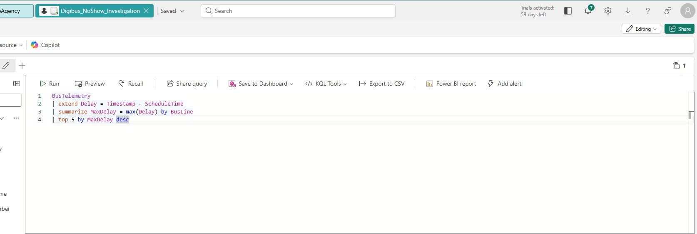
> Configured Data Activator rule to monitor the KQL query and send a Teams message when the condition is met.

---

### 08 — Data Activator Rule Configuration
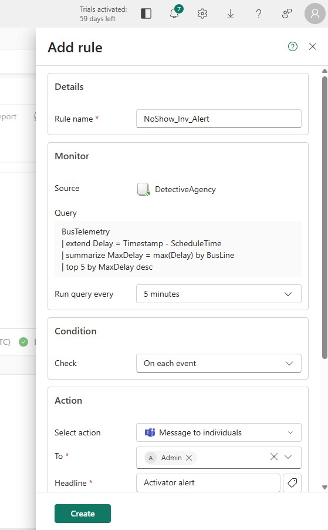
> Rule **NoShow_Inv_Alert** configured with the detection query embedded, running every 5 minutes, sending Teams messages to Admin.

---

### 09 — KQL Fixed Query with Threshold
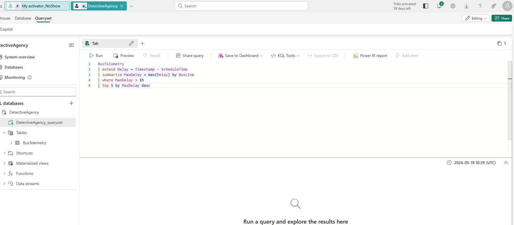
> Added `| where MaxDelay > 1h` to prevent alert fatigue. First iteration of the fix.

---

### 10 — Data Activator Improved Rule
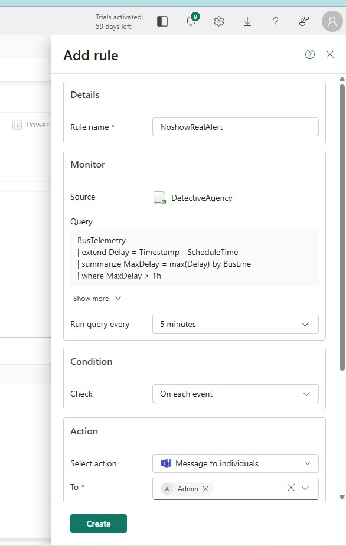
> New rule **NoshowRealAlert** built with the threshold condition applied.

---

### 11 — Alert Fatigue in Action (The Problem)
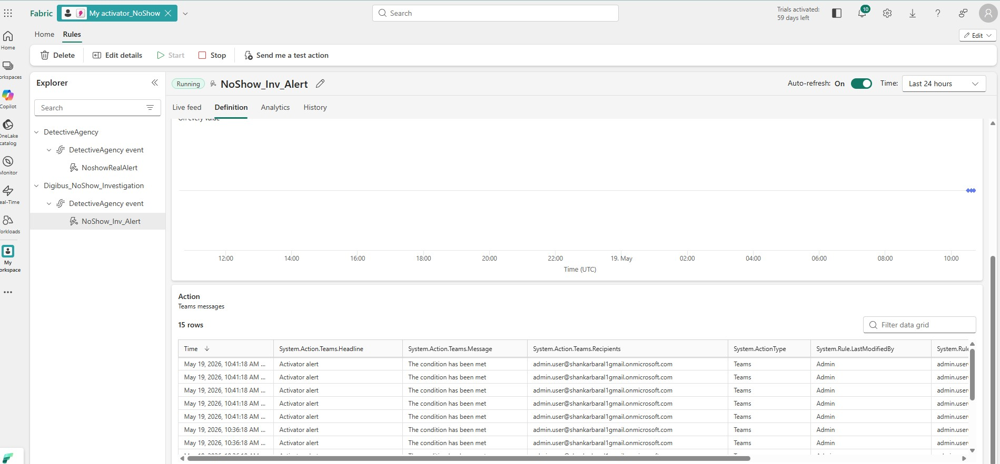
> **Critical finding:** Rule **NoShow_Inv_Alert** fired 15 Teams messages in under 10 minutes with no threshold. This is live proof of alert fatigue — one of the leading causes of missed detections in production SOC environments.

---

### 12 — Fixed Alert — No False Positives
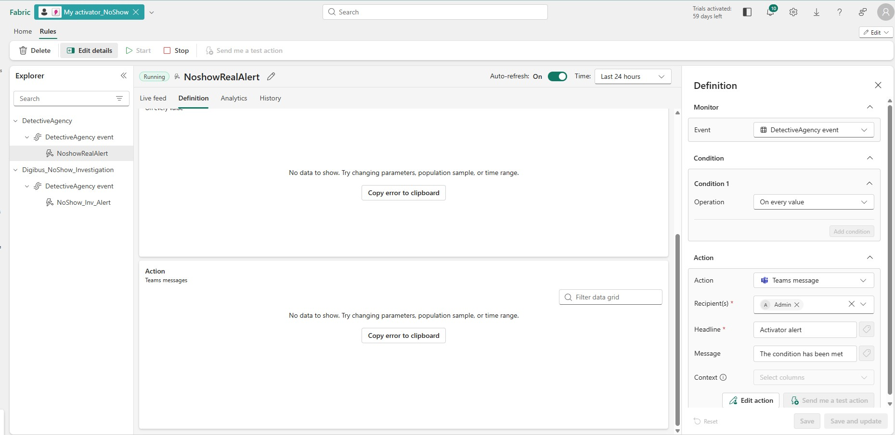
> **NoshowRealAlert** with threshold applied. No data shown — overnight monitoring confirmed the rule was running cleanly without spam.

---

### 13 — Final Query Results
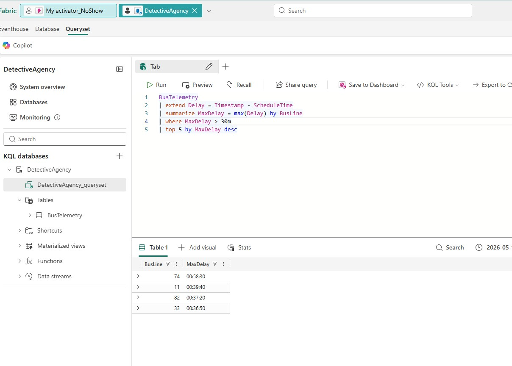
> Threshold tuned to `30m` — Bus Lines 74 and 11 surface as the anomalous no-show culprits with delays of 58 and 39 minutes respectively.

---

### 14 — Case Solved ✅
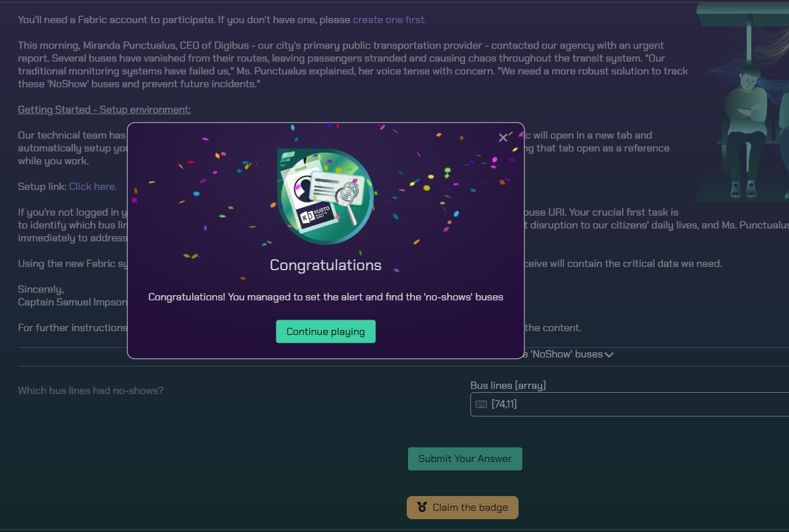
> Kusto Detective Agency confirmed the answer correct. Pipeline is live and continuously monitoring — not dependent on a fixed dataset.

---

## 🔬 KQL Query Evolution

### Attempt 1 — Wrong column name (error)
```kql
BusTelemetry
// ❌ Error: column 'ScheduledTime' does not exist
| extend Delay = Timestamp - ScheduledTime
| summarize MaxDelay = max(Delay) by BusLine
| top 5 by MaxDelay desc
```

### Attempt 2 — Correct column, no threshold (alert fatigue)
```kql
BusTelemetry
// ⚠️ Runs but fires alerts continuously — no anomaly filter
| extend Delay = Timestamp - ScheduleTime
| summarize MaxDelay = max(Delay) by BusLine
| top 5 by MaxDelay desc
```

### Final Query — Production ready ✅
```kql
BusTelemetry
// ✅ Threshold-filtered anomaly detection
| extend Delay = Timestamp - ScheduleTime
| summarize MaxDelay = max(Delay) by BusLine
| where MaxDelay > 30m
| top 5 by MaxDelay desc
```

---

## 🐛 Known Issues & Resolutions

### Issue #1 — Alert Fatigue
| | |
|---|---|
| **Problem** | Rule `NoShow_Inv_Alert` fired 15 Teams messages in minutes with no threshold condition |
| **Root Cause** | No `where` filter on MaxDelay — alert triggered on every query result |
| **Fix** | Added `\| where MaxDelay > 30m` to only alert on genuine anomalies |
| **SOC Relevance** | Alert fatigue is a leading cause of missed detections in real SOC environments |

### Issue #2 — Threshold Too Strict
| | |
|---|---|
| **Problem** | Initial fix set `MaxDelay > 1h` — overnight monitoring returned zero alerts |
| **Root Cause** | Overcorrection — live dataset delays were consistently under 1 hour |
| **Fix** | Lowered threshold to `30m` after analysing live data distribution |
| **SOC Relevance** | Mirrors real SIEM tuning cycles — iterating between false-positive and false-negative extremes |

---

## 🎯 SOC Skills Demonstrated

| Skill | How It Was Applied |
|-------|-------------------|
| **KQL Query Writing** | Wrote and iterated 3 versions of anomaly detection logic |
| **Real-Time Data Ingestion** | Configured Eventhouse + Eventstream pipeline |
| **Alert Rule Building** | Built 2 Data Activator rules with Teams integration |
| **Alert Tuning** | Identified and resolved alert fatigue through threshold analysis |
| **Incident Investigation** | Translated a business problem into a technical detection query |
| **Cloud Environment Setup** | Provisioned and configured a full Microsoft Fabric tenant |

> **Sentinel Connection:** KQL is the native query language for Microsoft Sentinel. Every query in this project runs identically in a Sentinel Log Analytics workspace. The alert tuning workflow directly mirrors Sentinel analytic rule development.

---

## 🗺️ What's Next

- [ ] Complete Kusto Detective Agency Case 2
- [ ] Recreate this detection pipeline in Microsoft Sentinel
- [ ] Add a Power BI real-time dashboard on the BusTelemetry Eventhouse
- [ ] Write detection rules for additional anomaly patterns

---

## 📁 Repository Structure

```
fabric-fleet-telemetry-pipeline/
├── README.md
├── queries/
│   ├── attempt1_wrong_column.kql
│   ├── attempt2_no_threshold.kql
│   └── final_anomaly_detection.kql
└── images/
    ├── 01_Project_Requirement_Brief.png
    ├── 02_Microsoft_Fabric_Environment_Setup.png
    ├── 03_Fabric_Workspace_Dashboard.png
    ├── 04_Eventhouse_Provisioning_In_Progress.png
    ├── 05_KQL_Queryset_Creation_BusTelemetry_Live.png
    ├── 06_KQL_Workbench_Connected_To_BusTelemetry.png
    ├── 07_Data_Activator_Alert_Attempted.png
    ├── 08_Data_Activator_Rule_Configuration.png
    ├── 09_KQL_Fixed_Query_Threshold_Added.png
    ├── 10_Data_Activator_Fixed_Rule_NoshowRealAlert.png
    ├── 11_Data_Activator_OldAlert_Firing_AlertFatigue.png
    ├── 12_Data_Activator_NewAlert_ThresholdFixed.png
    ├── 13_KQL_Live_Query_Results_Threshold_30m.png
    └── 14_Case1_Solved_Congratulations.png
```

---

*Part of an ongoing Kusto Detective Agency series — Case 2 coming soon.*

