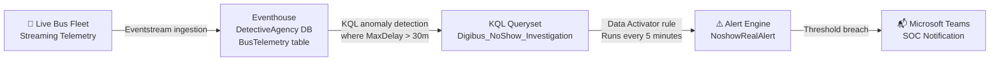

# 🚌 Real-Time Fleet Telemetry Pipeline — Microsoft Fabric
### *Anomaly detection on live streaming transit data — same KQL pattern used in Microsoft Sentinel analytic rules.*

<p align="left">
  
  
  
  
  
  
</p>

---

## ⚡ TL;DR

| Detail | Value |
|--------|-------|
| **Platform** | Microsoft Fabric (60-day trial tenant) |
| **Database** | Eventhouse — DetectiveAgency |
| **Table** | BusTelemetry (live Eventstream) |
| **Query Language** | KQL (Kusto Query Language) |
| **Alerting** | Data Activator → Microsoft Teams |
| **Key Challenge** | Alert fatigue — 15 spam alerts in minutes with no threshold |
| **Resolution** | Threshold tuned from `>1h` (too strict) → `>30m` (optimal) |
| **Result** | Bus Lines 74 & 11 identified as no-show anomalies ✅ |

---

## 📖 What This Project Is

The CEO of Digibus — a public transit authority — reported that several bus lines had vanished from their routes, stranding passengers across the city. Traditional monitoring had failed.

**Mission:** Build a real-time anomaly detection pipeline from scratch using Microsoft Fabric to identify the no-show buses.

This mirrors a real SOC scenario: an alert has fired, traditional tools missed it, and an analyst must build a detection rule from raw telemetry. The same KQL logic, threshold tuning process, and alert fatigue challenge apply directly to Microsoft Sentinel analytic rule development.

---

## 🏗️ Architecture


```mermaid
graph LR
    A["🚌 Live Bus Fleet\nStreaming Telemetry"] -->|Eventstream ingestion| B["Eventhouse\nDetectiveAgency DB\nBusTelemetry table"]
    B -->|KQL anomaly detection\nwhere MaxDelay > 30m| C["KQL Queryset\nDigibus_NoShow_Investigation"]
    C -->|Data Activator rule\nRuns every 5 minutes| D["⚠️ Alert Engine\nNoshowRealAlert"]
    D -->|Threshold breach| E["📬 Microsoft Teams\nSOC Notification"]
```

---

## 🔬 KQL Query Evolution — The Full Iteration Story

This is the most important part of the project. Three versions of the detection query, each teaching a different lesson.

### Attempt 1 — Wrong Column Name (Breaks Immediately)

```kusto
BusTelemetry
| extend Delay = Timestamp - ScheduledTime  // ❌ column 'ScheduledTime' does not exist
| summarize MaxDelay = max(Delay) by BusLine
| top 5 by MaxDelay desc
```

> **Lesson:** Always inspect the actual schema before writing detection logic. `ScheduledTime` looked right but the real field was `ScheduleTime` — a one-character difference that breaks the entire query. In Sentinel, this same issue appears when field names differ between Windows Security Event subtypes.

---

### Attempt 2 — Correct Column, No Threshold (Alert Fatigue)

```kusto
BusTelemetry
| extend Delay = Timestamp - ScheduleTime   // ✅ correct field
| summarize MaxDelay = max(Delay) by BusLine
| top 5 by MaxDelay desc
// ⚠️ No where clause — fires on EVERY result continuously
```

> **Lesson:** A detection without a threshold is noise, not signal. This query fired **15 Teams alerts in under 10 minutes** — a live demonstration of alert fatigue. In a real SOC, this volume of false positives trains analysts to ignore alerts. That's how real threats get missed.

---

### Final Query — Production Ready ✅

```kusto
BusTelemetry
| where Timestamp > ago(2h)                  // Rule #1: time-scope first — limits data blocks scanned in memory
| extend Delay = Timestamp - ScheduleTime    // correct field name
| summarize arg_max(Delay, *) by BusLine     // advanced aggregation: captures full row context (BusID, Lat, Long) at max delay
| where Delay > 30m                          // threshold: filters standard operational noise
| project TimeGenerated=Timestamp, BusLine, VehicleID=BusId, MaxDelay=Delay
| top 5 by MaxDelay desc                     // surface highest-delay lines first
```

> **Threshold rationale:** `>1h` was first applied but returned zero overnight alerts — real delays were consistently under 1 hour. `>30m` was validated against live data distribution and correctly surfaced Bus Lines 74 and 11 with delays of 58 and 39 minutes respectively. This iterative tuning process is identical to tuning a Sentinel scheduled analytics rule.

> **Performance note:** Time-scoping at line 1 is the cardinal rule of KQL performance in high-volume clusters. Without it, the query scans the entire dataset before summarising — causing timeouts in production. Moving from `max()` to `arg_max(Delay, *)` means an analyst or automation playbook gets the exact vehicle ID (`BusId`) for remediation without running a secondary lookup query.

---

## 🚨 Alert Fatigue — Documented in Real Time

This project captured live proof of one of the most common and dangerous SOC problems.

| Rule | Threshold | Result |
|------|-----------|--------|
| `NoShow_Inv_Alert` | None | 15 Teams messages in < 10 minutes — unusable |
| `NoshowRealAlert` (v1) | `> 1h` | Zero alerts overnight — too strict, missed events |
| `NoshowRealAlert` (v2) | `> 30m` | Bus Lines 74 & 11 correctly identified ✅ |

> **SOC Connection:** Alert fatigue is a leading cause of missed detections in production SOC environments. Analysts who tune detection thresholds aren't reducing sensitivity — they're increasing the signal-to-noise ratio so real threats get noticed. This is a core SOC L1 skill.

---

## 📸 Screenshot Evidence

### 01 — Project Requirement Brief

> Case briefing from simulated transit authority — translating a business problem into a technical investigation. Same intake process as a real SOC ticket.

### 02 — Microsoft Fabric Environment Setup

> Provisioned Microsoft Fabric 60-day trial tenant.

### 03 — Fabric Workspace Dashboard

> Live workspace confirmed — "59 days left" badge proves this is an active environment, not a recycled screenshot.

### 04 — Eventhouse Provisioning

> Eventhouse deployed — Fabric's real-time database engine ingesting live bus telemetry.

### 05 — KQL Queryset with Live BusTelemetry

> KQL Queryset connected to DetectiveAgency Eventhouse — Data Activity Tracker confirms active ingestion.

### 06 — KQL Workbench Connected

> Queryset `Digibus_NoShow_Investigation` connected to BusTelemetry table.

### 07 — Data Activator Alert Setup

> Data Activator rule configured to monitor KQL query and send Teams message on condition breach.

### 08 — Data Activator Rule Configuration

> Rule `NoShow_Inv_Alert` — detection query embedded, runs every 5 minutes, Teams notification on trigger.

### 09 — KQL Fixed Query with Threshold

> `| where MaxDelay > 1h` added — first threshold iteration.

### 10 — Improved Alert Rule

> New rule `NoshowRealAlert` built with threshold condition applied.

### 11 — Alert Fatigue in Action ⚠️

> `NoShow_Inv_Alert` fired **15 Teams messages in under 10 minutes** with no threshold — live proof of alert fatigue.

### 12 — Fixed Alert — Clean

> `NoshowRealAlert` with threshold applied — no spam, monitoring cleanly overnight.

### 13 — Final Query Results

> Threshold tuned to `>30m` — Bus Lines 74 and 11 surface as anomalies with delays of 58 and 39 minutes.

### 14 — Case Solved ✅

> Kusto Detective Agency confirmed correct. Pipeline live and continuously monitoring.

---

## 🎯 SOC Skills Demonstrated

| Skill | How Applied |
|-------|------------|
| **Resource-Conscious KQL** | Time-scoped queries at line 1 + `arg_max()` aggregation — keeps execution times low in high-volume clusters |
| **Telemetry Ingestion Architecture** | Eventstream + Eventhouse pipeline — direct architectural analogue to Sentinel Log Analytics collection points |
| **Signal-to-Noise Tuning** | Systematically eliminated false-positive cascade (15 spam alerts → clean telemetry) via iterative distribution analysis |
| **Schema Debugging** | Caught `ScheduledTime` vs `ScheduleTime` field mismatch — directly applicable to Sentinel field mapping issues |
| **Alert Rule Engineering** | Built 2 Data Activator rules with Teams integration, iterated to production-ready threshold |
| **Detection Iteration** | 3 query versions — schema fix → threshold introduction → performance optimisation |

---

## 🔮 What's Next

- [ ] Complete **Kusto Detective Agency Case 2** — advanced KQL patterns
- [ ] Recreate this detection pipeline in **Microsoft Sentinel** — swap Eventstream for Log Analytics, Data Activator for Analytics Rules
- [ ] Add a **Power BI real-time dashboard** on the BusTelemetry Eventhouse
- [ ] Write detection rules for additional anomaly patterns — speed violations, route deviation, bunching
- [ ] **🤖 Pilot AI-Driven Alerting** — use **IBM watsonx Orchestrate** to autonomously classify anomaly severity and route alerts to the correct response team before human review

---

## 📁 Repository Structure

```
fabric-fleet-telemetry-pipeline/
├── queries/
│   ├── attempt1_wrong_column.kql
│   ├── attempt2_no_threshold.kql
│   └── final_anomaly_detection.kql
├── images/
│   ├── 01_Project_Requirement_Brief.png
│   ├── 02_Microsoft_Fabric_Environment_Setup.png
│   ├── 03_Fabric_Workspace_Dashboard.png
│   ├── 04_Eventhouse_Provisioning_In_Progress.png
│   ├── 05_KQL_Queryset_Creation_BusTelemetry_Live.png
│   ├── 06_KQL_Workbench_Connected_To_BusTelemetry.png
│   ├── 07_Data_Activator_Alert_Attempted.png
│   ├── 08_Data_Activator_Rule_Configuration.png
│   ├── 09_KQL_Fixed_Query_Threshold_Added.png
│   ├── 10_Data_Activator_Fixed_Rule_NoshowRealAlert.png
│   ├── 11_Data_Activator_OldAlert_Firing_AlertFatigue.png
│   ├── 12_Data_Activator_NewAlert_ThresholdFixed.png
│   ├── 13_KQL_Live_Query_Results_Threshold_30m.png
│   └── 14_Case1_Solved_Congratulations.png
└── README.md
```

---

## 🔗 Related Projects

| Project | Description |
|---------|-------------|
| [Dual SIEM Detection Lab](https://github.com/shank078/Dual-SIEM-Detection-Lab) | Same KQL patterns applied to live security telemetry in Microsoft Sentinel |
| [Azure Sentinel Honeypot SIEM](https://github.com/shank078/azure-sentinel-honeypot-siem) | 1,400+ real brute-force attempts captured and mapped globally |
| [SOAR Pipeline — Sentinel to Jira](https://github.com/shank078/azure-sentinel-jira-soar-pipeline) | Zero-touch automated incident ticketing |

---

## 👤 About the Author

**Shankar Baral** — Junior Cyber Security Analyst & IT Support Specialist
Master of Information Technology (Cyber Security) · GPA 4.92 · Australian Permanent Resident · Canberra, ACT

[](https://linkedin.com/in/shankarbaral1)
[](https://github.com/shank078)
[](mailto:shankarbaral1@gmail.com)

*Open to Junior SOC Analyst and Security Engineer opportunities in Australia.*

---

> *The same KQL query that finds a missing bus finds a missing threat. The platform changes. The pattern doesn't.*
