# Real-Time Fleet Telemetry Pipeline — Microsoft Fabric

### Anomaly detection on live streaming data in KQL — built for Microsoft's Kusto Detective Agency (Fabric Special) and solved on a real Fabric tenant.

<p align="left">
  
  
  
  
  
</p>

---

## TL;DR

| Detail | Value |
|--------|-------|
| **Platform** | Microsoft Fabric (60-day trial tenant) |
| **Database** | Eventhouse — DetectiveAgency |
| **Table** | BusTelemetry (live Eventstream) |
| **Query Language** | KQL (Kusto Query Language) |
| **Alerting** | Data Activator → Microsoft Teams |
| **Key Challenge** | Alert fatigue — 15 Teams alerts in under 10 minutes with no threshold |
| **Resolution** | Threshold iterated from none → `>1h` (no hits) → `>30m` (validated against the data) |
| **Result** | 4 bus lines over threshold; lines 74 & 11 confirmed as the no-shows |

---

## What This Project Is

This is Microsoft's [Kusto Detective Agency](https://detective.kusto.io/) — Fabric Special, Case 1: a hands-on challenge where you provision a real Microsoft Fabric environment, connect to a live streaming telemetry table, and find which bus lines have stopped running. The scenario is fictional; the infrastructure, the streaming data, the KQL, and the alerting are not.

I used it as KQL and Fabric practice, and it turned out to teach a lesson I care about more than the puzzle: what happens when you deploy an alert rule without a threshold. My first Data Activator rule flooded Teams with 15 messages in under 10 minutes — a small, self-inflicted case study in alert fatigue, which I then fixed by iterating the threshold against the live data.

The transfer to SOC work is direct: the same detect → too noisy → tune → validate loop is how a Microsoft Sentinel scheduled analytics rule gets from draft to production.

---

## Architecture

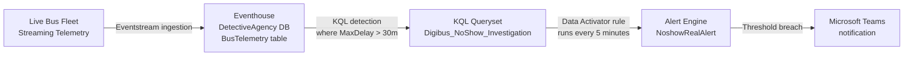
```mermaid
graph LR
    A["Live Bus Fleet\nStreaming Telemetry"] -->|Eventstream ingestion| B["Eventhouse\nDetectiveAgency DB\nBusTelemetry table"]
    B -->|"KQL detection\nwhere MaxDelay > 30m"| C["KQL Queryset\nDigibus_NoShow_Investigation"]
    C -->|"Data Activator rule\nruns every 5 minutes"| D["Alert Engine\nNoshowRealAlert"]
    D -->|Threshold breach| E["Microsoft Teams\nnotification"]
```

---

## KQL Query Evolution

Three versions of the detection, each one fixing what the previous one got wrong. All three are committed in [`queries/`](queries/).

### Attempt 1 — Wrong column name (fails immediately)

```kusto
BusTelemetry
| extend Delay = Timestamp - ScheduledTime   // column 'ScheduledTime' does not exist
| summarize MaxDelay = max(Delay) by BusLine
| top 5 by MaxDelay desc
```

The real field is `ScheduleTime` — one character off, and the query doesn't run. Checking the actual schema before writing detection logic sounds obvious; I still skipped it, once. The same trap exists in Sentinel where field names differ between Windows Security Event subtypes.

### Attempt 2 — Correct column, no threshold (alert fatigue)

```kusto
BusTelemetry
| extend Delay = Timestamp - ScheduleTime
| summarize MaxDelay = max(Delay) by BusLine
| top 5 by MaxDelay desc
```

This is the query I embedded in the first Data Activator rule. With no `where` clause, every evaluation produced results, and the rule fired on each one: **15 Teams messages in under 10 minutes** (screenshot 11). A detection without a threshold is noise, and this much noise is how real alerts get ignored.

### Final — thresholded (as run, screenshot 13)

```kusto
BusTelemetry
| extend Delay = Timestamp - ScheduleTime
| summarize MaxDelay = max(Delay) by BusLine
| where MaxDelay > 30m
| top 5 by MaxDelay desc
```

**Threshold rationale:** I tried `>1h` first (screenshot 09) — it returned nothing overnight, because the real delays sat under an hour. Dropping to `>30m` and re-checking against the live distribution surfaced four bus lines: 74 (58 min), 11 (39 min), 82 (37 min) and 33 (36 min). The top two — **74 and 11** — were confirmed by the case as the actual no-shows. That candidates-then-confirm flow is the same shape as tuning a Sentinel scheduled rule and validating hits before acting on them.

There is also a [`final_anomaly_detection_improved.kql`](queries/final_anomaly_detection_improved.kql) in the queries folder — a post-lab revision, not the version in the screenshots. It adds a `where Timestamp > ago(2h)` time-scope (limits the scan window once the table outgrows a demo dataset) and swaps `max()` for `arg_max(Delay, *)` so the full row context survives aggregation. I kept it separate rather than pretending it's what ran.

---

## Alert Fatigue — Documented as It Happened

| Rule | Threshold | Result |
|------|-----------|--------|
| `NoShow_Inv_Alert` | None | 15 Teams messages in under 10 minutes — unusable |
| `NoshowRealAlert` (v1) | `> 1h` | Zero alerts overnight — too strict for this data |
| `NoshowRealAlert` (v2) | `> 30m` | 4 lines surfaced; 74 & 11 confirmed as no-shows |

Tuning a threshold isn't reducing sensitivity — it's raising the signal-to-noise ratio so the alerts that do fire get read. Watching my own Teams channel become unusable in ten minutes made that concrete in a way reading about it never had.

---

## Screenshot Evidence

### 01 — Case briefing
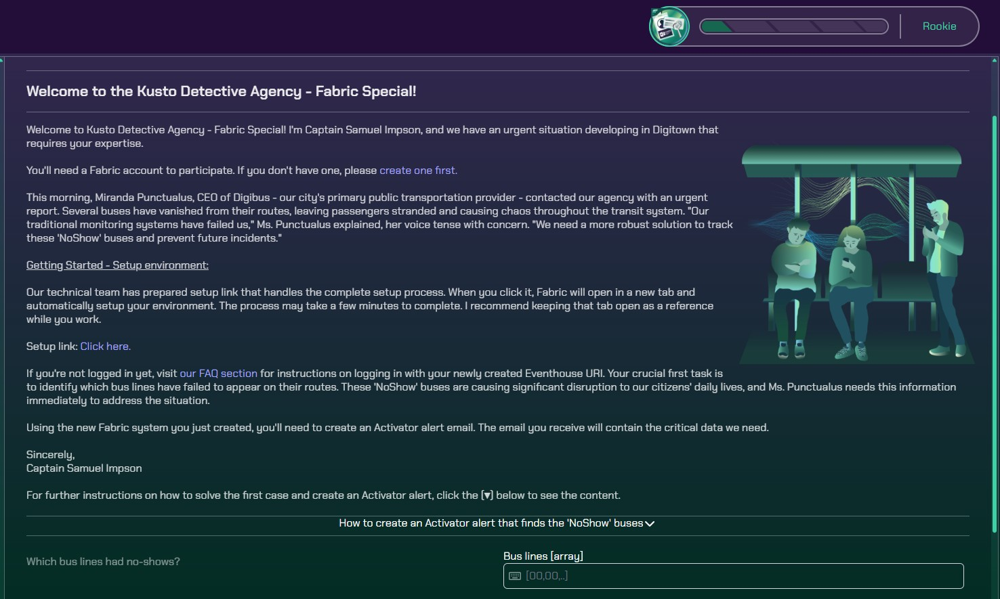
> The Kusto Detective Agency (Fabric Special) Case 1 brief — the intake that gets translated into a technical investigation.

### 02 — Microsoft Fabric environment setup
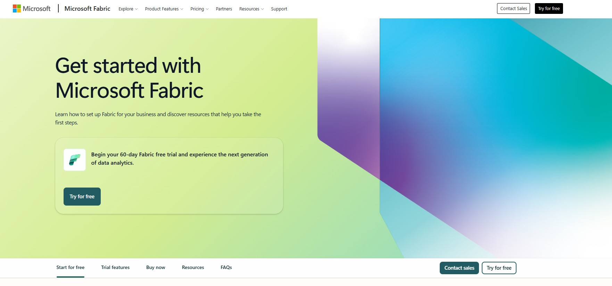
> Fabric 60-day trial tenant provisioned.

### 03 — Fabric workspace dashboard
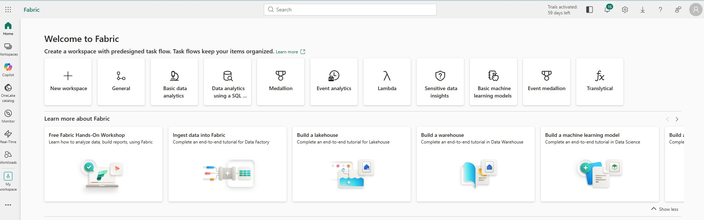
> Workspace live on the trial tenant.

### 04 — Eventhouse provisioning
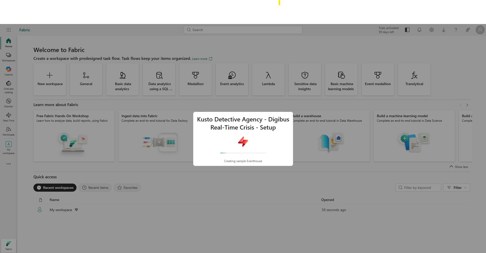
> Eventhouse deployed — Fabric's real-time database engine, ingesting the bus telemetry stream.

### 05 — KQL queryset with live BusTelemetry
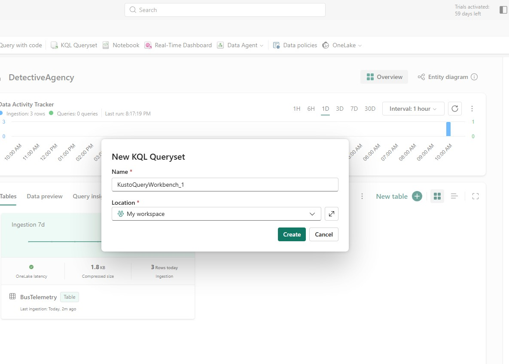
> Queryset connected to the DetectiveAgency Eventhouse; the data activity tracker shows active ingestion.

### 06 — Queryset connected
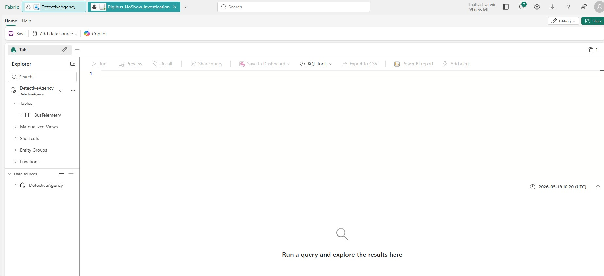
> `Digibus_NoShow_Investigation` queryset connected to the BusTelemetry table.

### 07 — Data Activator alert setup
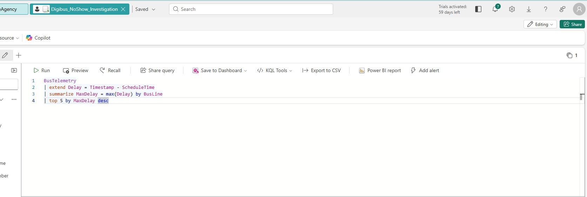
> First Data Activator rule being configured against the KQL query.

### 08 — Rule configuration
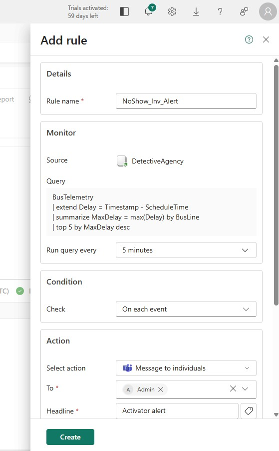
> `NoShow_Inv_Alert` — detection query embedded, evaluated every 5 minutes, Teams message on trigger. Note there is no threshold in the embedded query yet.

### 09 — First threshold added
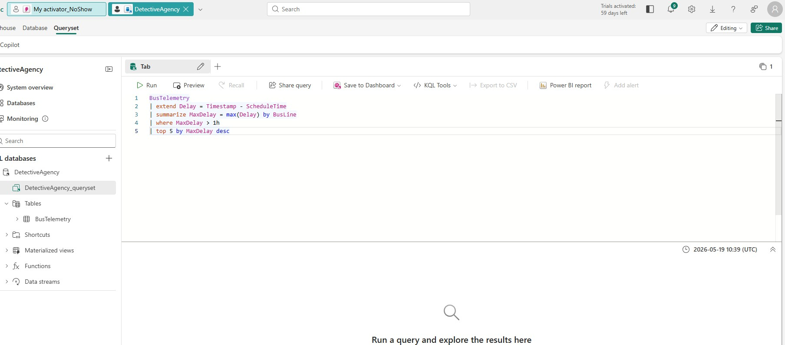
> `| where MaxDelay > 1h` — the first threshold iteration, which turned out to be too strict.

### 10 — Second rule with threshold
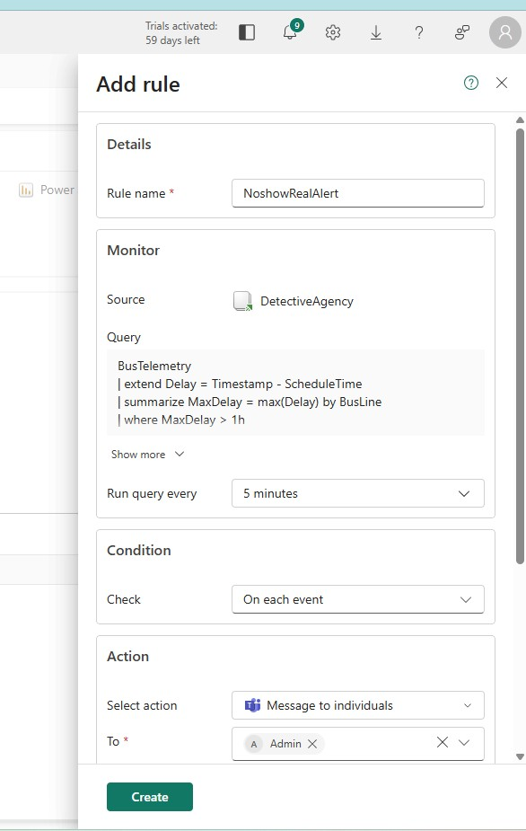
> `NoshowRealAlert` built with the threshold condition applied.

### 11 — Alert fatigue, live
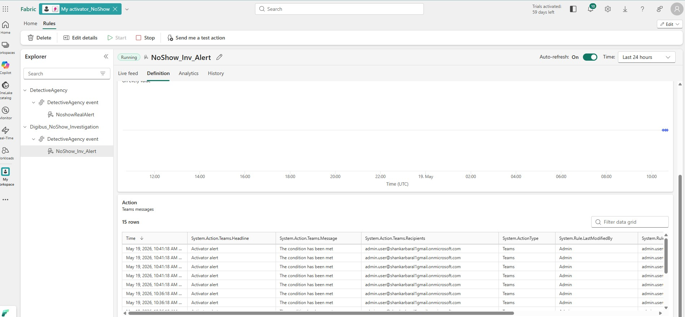
> The unthresholded rule's action log: 15 Teams messages, timestamps minutes apart.

### 12 — Fixed alert running clean
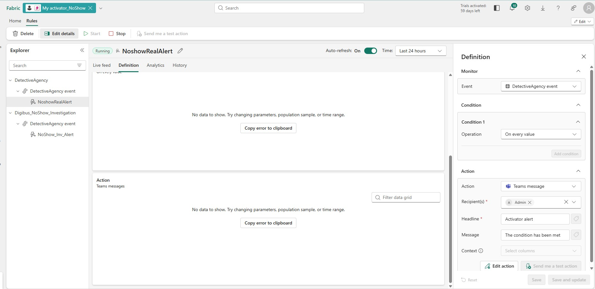
> `NoshowRealAlert` with the threshold — no spam while monitoring overnight.

### 13 — Final query results
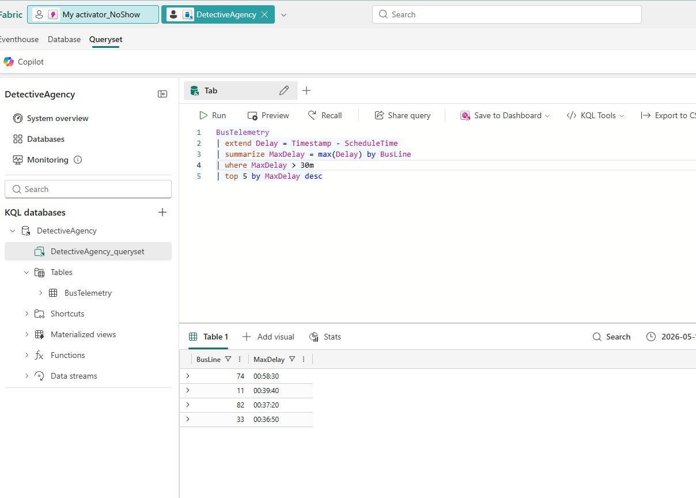
> `>30m` threshold — four lines over threshold, led by 74 (58:30) and 11 (39:40).

### 14 — Case solved
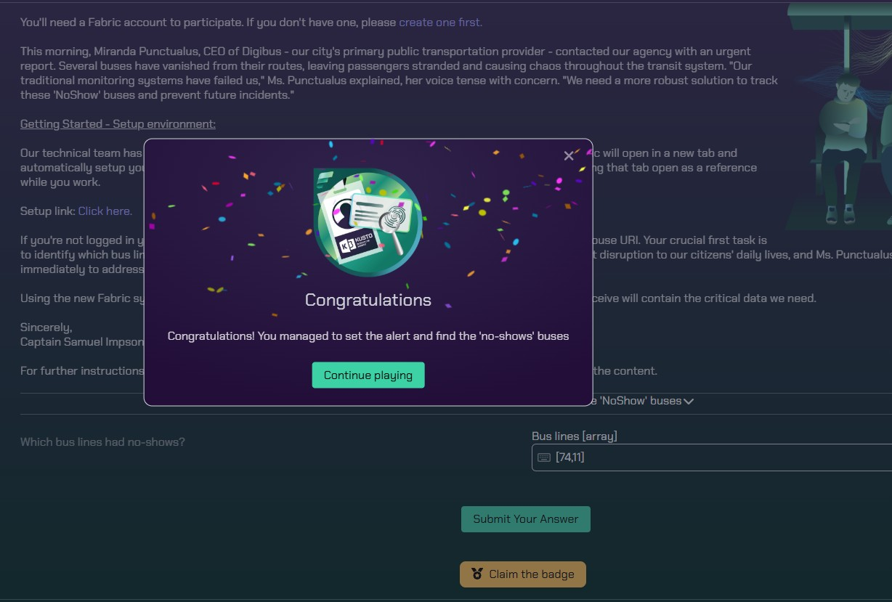
> Answer `[74, 11]` accepted by the Kusto Detective Agency.

---

## Skills This Exercised

| Skill | Where it shows |
|-------|----------------|
| **Schema-first debugging** | `ScheduledTime` vs `ScheduleTime` — attempt 1 vs attempt 2 |
| **Threshold tuning** | none → `>1h` → `>30m`, each validated against live data |
| **Alert fatigue handling** | 15-message flood diagnosed and fixed with a threshold, not by muting the rule |
| **Streaming ingestion** | Eventstream → Eventhouse pipeline — the Fabric analogue of a Sentinel Log Analytics collection path |
| **Alert rule engineering** | Two Data Activator rules with Teams integration, 5-minute evaluation cycle |

---

## What's Next

- [ ] Kusto Detective Agency Case 2 — more advanced KQL patterns
- [ ] Recreate this detection in **Microsoft Sentinel** — Log Analytics in place of Eventstream, a scheduled analytics rule in place of Data Activator
- [ ] A Power BI real-time dashboard on the BusTelemetry Eventhouse
- [ ] Additional anomaly patterns — speed violations, route deviation, bus bunching

---

## Repository Structure

```
fabric-fleet-telemetry-pipeline/
├── README.md
├── LICENSE
├── .gitignore
├── queries/
│   ├── attempt1_wrong_column.kql            # fails by design — schema lesson
│   ├── attempt2_no_threshold.kql            # the alert-fatigue query (as embedded in the rule)
│   ├── final_anomaly_detection.kql          # as run — matches screenshot 13
│   └── final_anomaly_detection_improved.kql # post-lab revision, not the lab-run version
└── images/                                   # 14 screenshots — setup, rules, fatigue, results
```

---

## Related Projects

| Project | Description |
|---------|-------------|
| [Dual SIEM Detection Lab](https://github.com/shank078/Dual-SIEM-Detection-Lab) | The same KQL discipline applied to live security telemetry in Sentinel and Splunk |
| [Azure Sentinel Honeypot SIEM](https://github.com/shank078/azure-sentinel-honeypot-siem) | 1,400+ real brute-force attempts captured and mapped globally |
| [SOAR Pipeline — Sentinel to Jira](https://github.com/shank078/azure-sentinel-jira-soar-pipeline) | Automated incident ticketing from Sentinel |

---

## About

Built and documented by **Shankar Baral** — junior SOC analyst in Canberra, Australia. More about me and my other labs: [github.com/shank078](https://github.com/shank078) · [LinkedIn](https://www.linkedin.com/in/shankarbaral1)
